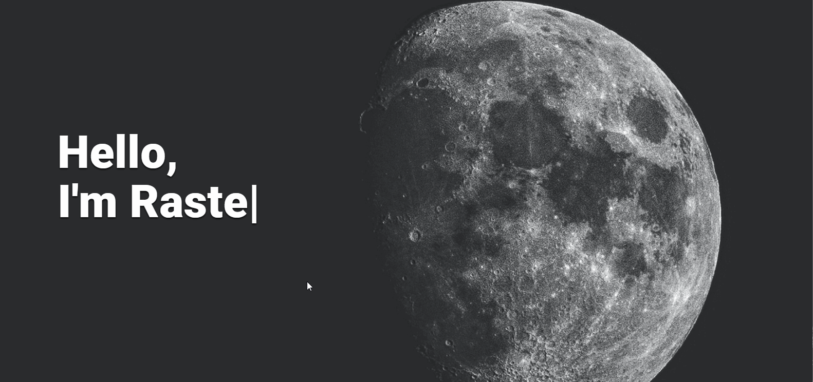
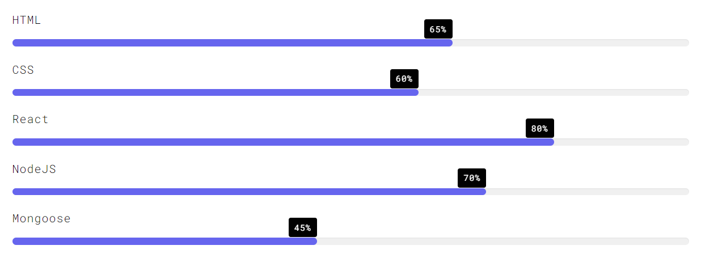

### Hi there, I'm Gabriel Rasteli 👋

## Full-Stack Developer
I am a 20-year-old full-stack developer, mainly focused on web development. I have been developing for 4 years and I am currently living in Brazil. In my spare time, I create open source projects and enjoy reading and playing Minecraft.

## Relevant Skills

> I'm also learning Angular right now.

## Hit me up ;)
I am now looking for a job as a front-end/back-end/full-stack developer at a real company. I'm also available for freelancing stuff if I have the time for it. Please, don't be shy :)

## Graduation
I'm a Computer Science undergraduate at Centro Universitário Barão de Mauá.

<!--
**rasteli/rasteli** is a ✨ _special_ ✨ repository because its `README.md` (this file) appears on your GitHub profile.

Here are some ideas to get you started:

- 🔭 I’m currently working on ...
- 🌱 I’m currently learning ...
- 👯 I’m looking to collaborate on ...
- 🤔 I’m looking for help with ...
- 💬 Ask me about ...
- 📫 How to reach me: ...
- 😄 Pronouns: ...
- ⚡ Fun fact: ...
-->
